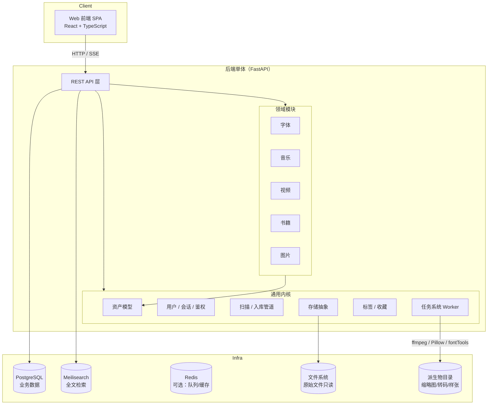

# 个人资源管理门户 · 总体规划设计

> 版本 v0.3 · 2026-10-05 · 状态：技术方案已确认（见 §15），待启动开发（M0）· 本版变更：电影模块调整为视频模块
> 目标：自建一个个人门户网站，统一管理**字体、音乐、视频、书籍、图片**五类资源，支持入库维护、检索查询、在线预览、下载分享。所有管理模块自行实现，开源项目仅作为参考代码来源。

---

## 1. 目标与范围

### 1.1 核心能力矩阵

| 能力 | 字体 | 音乐 | 视频 | 书籍 | 图片 |
|---|---|---|---|---|---|
| 入库（扫描/上传） | ✅ | ✅ | ✅ | ✅ | ✅ |
| 元数据维护（手动编辑 + 自动解析） | ✅ | ✅ | ✅ | ✅ | ✅ |
| 标签 / 收藏 / 备注 | ✅ | ✅ | ✅ | ✅ | ✅ |
| 全局搜索 | ✅ | ✅ | ✅ | ✅ | ✅ |
| 在线预览 | 字形样张墙 | 流式播放 | 在线播放 | 阅读 | 大图/相册 |
| 下载（单个 / 批量打包） | ✅ | ✅ | ✅ | ✅ | ✅ |

### 1.2 明确不做（非目标）

- 社区 / 评论 / 协作功能——支持多用户（注册、登录，见 §4.7），但所有用户共享同一资源库，无租户隔离。
- 分布式 / 集群——单机部署，Docker Compose 一键起。
- 视频转码的高阶能力（多码率自适应、实时字幕烧录）作为二期可选，一期以直接播放为主。
- 不做资源抓取/下载器，只管理你已有的文件。

---

## 2. 总体架构

### 2.1 架构图



### 2.2 关键架构决策

| # | 决策 | 理由 |
|---|---|---|
| D1 | **单体后端，前后端分离 monorepo** | 单人项目，微服务只会增加运维成本；五类资源共享 80% 的内核逻辑 |
| D2 | **统一资产内核 + 领域扩展表** | 标签/搜索/下载/回收站等只写一遍；各类型差异放在扩展表和独立模块里 |
| D3 | **原始文件只读，不移动不重命名** | 你的目录组织是事实标准，系统只登记索引；"整理重命名"做成显式的可选功能 |
| D4 | **所有预览产物物化到派生物目录** | 缩略图、样张图、HLS 片段全部异步生成一次、反复使用；原始文件丢失可重建 |
| D5 | **数据库驱动的任务队列**（起步），预留 Redis | 避免一开始引入过多组件；任务量上来后再切 |
| D6 | **Meilisearch 做全局搜索** | 中文分词、拼音容错、facet 过滤开箱即用；PG FTS 中文支持要装扩展，运维麻烦 |
| D7 | **存储抽象接口** | 一期实现 local，接口预留 S3 / WebDAV，未来 NAS/网盘可平滑接入 |

---

## 3. 技术选型

| 层 | 推荐 | 备选 | 理由 |
|---|---|---|---|
| 后端语言/框架 | **Python 3.12 + FastAPI** | Go（单二进制部署更爽） | 媒体处理生态压倒性优势：`fontTools`（字体解析）、`mutagen`（音频标签）、`Pillow`/`libvips`（图片）、`PyMuPDF`（PDF）、`ffmpeg` 子进程、`exiftool`——全部现成，自实现各模块成本最低 |
| 数据库 | **PostgreSQL 16** | SQLite（起步可换，JSONB 支持弱） | JSONB 存异构元数据、数组字段存标签、性能足够 |
| 搜索 | **Meilisearch** | Typesense、PG FTS | 中文友好、typo 容错、facet 筛选 |
| 任务队列 | **PostgreSQL jobs 表起步**（机制见 §4.4），Redis 为升级选项 | Celery + Redis broker（起步过重） | 少一个常驻组件；任务与业务数据同库，事务一致、排查直观。吞吐不足或需跨进程推送时再切 Redis，接口不变 |
| 前端 | **React 18 + TypeScript + Vite**，shadcn/ui + TailwindCSS，TanStack Query | Vue 3 | 生态与预览组件（opentype.js、pdf.js、foliate-js 均为 JS 库，React 封装自然） |
| 媒体处理 | ffmpeg、exiftool、libvips | — | 事实标准 |
| 部署 | **Docker Compose** | 裸机 systemd | 一键起 server + postgres + meilisearch |

✅ 已确认（2026-10-05）：后端采用 Python 3.12 + FastAPI。鉴权自实现（argon2id 密码哈希 + 服务端会话），不引入第三方身份服务，方案见 §4.7。

### 3.1 PostgreSQL 16 选型依据（对比 MySQL）

| 能力点 | 对本项目的意义 |
|---|---|
| JSONB（GIN 索引、JSONPath、表达式索引） | §4.1「统一资产表 + meta JSONB」成立的地基：类型差异字段可建索引、可包含查询（`meta @> '{"kind":"tutorial"}'`）；MySQL 的 JSON 索引手段少、查询语法更绕 |
| 事务性 DDL | 迁移可整体提交/回滚（改列 + 回填 + 加约束一个事务完成）；MySQL DDL 隐式提交，迁移失败留脏状态。五个领域分五期迭代 schema 时价值最高 |
| 部分索引 | 软删回收站只对 `WHERE deleted_at IS NULL` 建索引，活跃数据索引更小；MySQL 无对应能力 |
| 数组类型 | 字体格式列表、语言覆盖等多值字段直接 `TEXT[]` + GIN；MySQL 只能用 JSON 数组模拟 |
| `gen_random_uuid()` 内建 | 资产主键 UUID 数据库侧直接生成 |
| 物化视图 | 仪表盘统计卡片（各类型数量、入库趋势）可物化定时刷新，MySQL 需自建汇总表 |
| pgvector 扩展 | 二期人脸识别 / AI 语义搜索的向量直接存 PG，免引入独立向量库（Immich 同路线） |
| 性能 | 十万行级两者都绰绰有余，不构成选型依据；MySQL 8 已追平 CHECK 约束、CTE/窗口函数、函数索引等旧短板 |

> 结论：换 MySQL 架构也能做，但 D2（统一资产内核）会变别扭、迁移变危险、二期 AI 需额外向量库。**PostgreSQL 16 已确认采用。**

---

## 4. 通用内核设计（最关键章节）

五类资源共享这一层，**先做内核，再做领域**。

### 4.1 统一资产模型

```sql
-- 核心资产表：五类资源共用
CREATE TABLE assets (
    id            UUID PRIMARY KEY DEFAULT gen_random_uuid(),
    asset_type    TEXT NOT NULL CHECK (asset_type IN ('font','music','video','book','image')),
    title         TEXT NOT NULL DEFAULT '',          -- 展示标题（可编辑，与文件名解耦）
    storage_key   TEXT NOT NULL,                     -- 存储抽象内的路径（不暴露给前端）
    file_name     TEXT NOT NULL,
    size_bytes    BIGINT NOT NULL,
    mime_type     TEXT,
    fingerprint   TEXT NOT NULL,                     -- sha256（图片等小文件）/ size+mtime 快速指纹（视频等大文件）
    meta          JSONB NOT NULL DEFAULT '{}',       -- 各类型自由扩展字段
    rating        SMALLINT,                          -- 0-5
    note          TEXT,
    is_favorite   BOOLEAN NOT NULL DEFAULT FALSE,
    deleted_at    TIMESTAMPTZ,                       -- 软删 → 回收站
    created_at    TIMESTAMPTZ NOT NULL DEFAULT now(),
    updated_at    TIMESTAMPTZ NOT NULL DEFAULT now(),
    UNIQUE (storage_key, fingerprint)
);

-- 层级标签
CREATE TABLE tags (
    id        UUID PRIMARY KEY DEFAULT gen_random_uuid(),
    name      TEXT NOT NULL,
    parent_id UUID REFERENCES tags(id),
    UNIQUE (name, parent_id)
);
CREATE TABLE asset_tags (
    asset_id UUID REFERENCES assets(id) ON DELETE CASCADE,
    tag_id   UUID REFERENCES tags(id) ON DELETE CASCADE,
    PRIMARY KEY (asset_id, tag_id)
);
```

- 类型强差异的数据（如视频的系列/集数、书籍的 ISBN）放 `meta` JSONB 或各自的扩展表。原则：**查询/筛选高频字段进列或扩展表，展示低频字段进 JSONB**。
- 派生物不进 `assets`，只按约定寻址：`/data/derived/{asset_type}/{asset_id}/thumb_256.webp`。

### 4.2 存储抽象

```python
class StorageProvider(Protocol):
    def stat(self, key: str) -> FileStat: ...
    def open(self, key: str) -> BinaryIO: ...        # 供解析器/派生物生成读取
    def stream(self, key: str, range: Range|None) -> StreamingResponse  # 下载/播放
    def iter_dir(self, prefix: str) -> Iterator[FileStat]: ...        # 扫描用
    def save(self, key: str, data: BinaryIO) -> None: ...             # 仅上传入口使用
```

一期实现 `LocalStorage`；接口签名兼容 S3/WebDAV 语义，二期可扩展。

### 4.3 入库管道

```
发现（目录扫描 / 网页上传 / watch 目录）
  → 去重（storage_key + fingerprint 命中即跳过）
  → 登记 assets（status=pending）
  → 类型解析器（Parser）填充 meta / 标题 / 封面
  → 投递派生任务（缩略图、样张、HLS…）
  → 状态机：pending → parsing → ready（可搜索可预览）｜ failed（可重试）
```

- 扫描器：配置若干「资源根目录」（如 `/data/fonts`、`/data/books`），按扩展名分拣到对应解析器。
- 幂等：解析器产出物写派生目录时先写临时文件再原子改名。
- 上传入口仅限管理端，复用同一管道。

### 4.4 任务系统

```sql
CREATE TABLE jobs (
    id         UUID PRIMARY KEY DEFAULT gen_random_uuid(),
    kind       TEXT NOT NULL,        -- 'thumb_image' | 'font_specimen' | 'transcode_hls' | 'index_meili' ...
    payload    JSONB NOT NULL,       -- {"asset_id": "..."}
    status     TEXT NOT NULL DEFAULT 'queued',   -- queued|running|done|failed
    priority   SMALLINT NOT NULL DEFAULT 5,
    attempts   SMALLINT NOT NULL DEFAULT 0,
    last_error TEXT,
    run_at     TIMESTAMPTZ NOT NULL DEFAULT now()
);
```

- 常驻 worker 进程（可随 server 同进程起步）轮询领取，指数退避重试 3 次。
- 任务分优先级：浏览触发的缩略图 > 批量入库的派生 > 索引更新。
- 管理端「任务中心」页面展示失败任务并可一键重跑。

**为什么用数据库当队列，而不是一上来就上 Redis + Celery**

- 领取任务就是一条 SQL：`SELECT ... WHERE status='queued' AND run_at <= now() ORDER BY priority, run_at LIMIT 1 FOR UPDATE SKIP LOCKED`。`SKIP LOCKED` 保证多 worker 并发领取时既不重复拿、也不互相锁等待。
- 与业务同库：任务登记与资产状态变更在同一个事务里，天然一致；任务中心直接查 `jobs` 表，无需额外设施；备份只有一套。
- 真实瓶颈是 ffmpeg / Pillow 的 CPU 处理而非派发延迟，1-2 秒轮询的 DB 队列完全够用（Rails Solid Queue、Elixir Oban 等成熟项目同思路）。

**何时切 Redis**：出现任一信号再升级——吞吐不足需要多机扩 worker；需要亚秒级派发或 SSE 跨进程推送扇出；需要热点缓存、分布式锁、限流。切换只替换 `enqueue / claim` 两个函数的驱动实现（postgres → redis），`jobs` 表保留作任务台账，业务代码零改动——这就是「Redis 可选」的含义：**不是现在决定用不用，而是保证以后切过去不用改设计**。

### 4.5 标签 / 收藏 / 智能集合

- 标签全局共用一套（五类资源可打同一标签），支持层级（如 `风格/衬线`）。
- 智能集合 = 保存的筛选条件 JSON（如 `type=font AND tag=中文`），本质是书签化的查询。

### 4.6 回收站 / 重复检测 / 导出

- 软删进回收站，30 天后清理任务确认原始文件是否删除（默认只解除索引，不动文件）。
- 重复检测：按 fingerprint 分组，入库时即时提示 + 管理页批量处理。
- 导出：全量元数据 JSON / CSV，用于备份或迁移。

### 4.7 用户与鉴权

**角色与权限矩阵**

| 能力 | admin | member（注册用户） | guest（未登录访客） |
|---|---|---|---|
| 浏览资源列表 / 网格页 | ✅ | ✅ | ✅ |
| 搜索（全局 + 筛选） | ✅ | ✅ | ❌ |
| 打开详情 / 在线预览 | ✅ | ✅ | ❌ |
| 下载 | ✅ | ✅ | ❌ * |
| 编辑资源元数据 / 标签管理 | ✅ | ❌ | ❌ |
| 入库（上传）/ 删除 / 系统设置 / 任务中心 | ✅ | ❌ | ❌ |
| 用户管理（关闭注册、停用账号） | ✅ | ❌ | ❌ |

> * 访客下载默认禁止（比照预览限制从严）。如希望放宽为「访客可浏览 + 下载、不可预览」，属于一行配置的调整，留作可调项。

**数据模型**

```sql
CREATE TABLE users (
    id            UUID PRIMARY KEY DEFAULT gen_random_uuid(),
    username      TEXT NOT NULL UNIQUE,
    password_hash TEXT NOT NULL,                 -- argon2id
    role          TEXT NOT NULL DEFAULT 'member' CHECK (role IN ('admin', 'member')),
    is_active     BOOLEAN NOT NULL DEFAULT TRUE,
    created_at    TIMESTAMPTZ NOT NULL DEFAULT now(),
    last_login_at TIMESTAMPTZ
);

CREATE TABLE sessions (
    id         TEXT PRIMARY KEY,                 -- 随机 token
    user_id    UUID NOT NULL REFERENCES users(id) ON DELETE CASCADE,
    expires_at TIMESTAMPTZ NOT NULL,
    created_at TIMESTAMPTZ NOT NULL DEFAULT now()
);
```

**机制要点**

- 注册：开放注册（用户名 + 密码），注册开关可在系统设置中关闭，关闭后仅 admin 可在用户管理页手工创建账号。
- 引导：首个 admin 由部署环境变量（`BOOTSTRAP_ADMIN_PASSWORD`）在启动时创建，不依赖注册顺序。
- 会话：服务端 `sessions` 表 + httpOnly Cookie（SameSite=Lax，30 天滑动过期），登出即吊销；刻意不用 JWT，换取可吊销性与在线用户管理能力。
- 权限落地：FastAPI 依赖注入两级依赖——`require_member`（搜索 / 详情 / 预览 / 下载等全部内容读取）与 `require_admin`（全部写操作）；浏览类列表接口公开匿名。
- 派生物不静态暴露：缩略图 / 样张 / 音频流 / HLS 片段一律经鉴权 API 流式输出（Cookie 同源自动携带，`` / `<video>` 无感）。

---

## 5. 领域模块设计

每个模块按「数据模型 → 入库解析 → 预览 → 下载 → 参考实现」展开。

### 5.1 字体模块（差异化最强，自建价值最高）

**数据模型**

| 字段 | 说明 |
|---|---|
| family | 字族名（name table ID 16/1），同 family 聚合为一组 |
| style / weight / italic | 子样式、字重（OS/2 usWeightClass）、是否斜体 |
| formats | otf / ttf / woff / woff2 |
| glyph_count / charset_coverage | 字形数、Unicode 覆盖（拉丁/中文/日文…） |
| variable_axes | 可变字体轴（wght/wdth…，fvar 表） |
| license / version / designer | name table + OFL.txt 识别 |

**入库解析**：`fontTools` 读 name/OS2/cmap/fvar 表；woff2 解压后统一处理；同 family 多文件聚合为「字族」展示单元。

**预览**（门户的核心体验）：
- **样张墙**：每个字体用自定义句子渲染（"永 东 Aa Bb 1234"，支持用户改预览文案全局生效）。
- 实现：前端直接加载字体文件（`FontFace` API + canvas），可变字体拖动轴实时变；服务端另生成静态样张图（Pillow）用于搜索结果缩略图。
- 字符集浏览器：按 Unicode 区块查看该字体覆盖的字形；缺字置灰。

**下载**：单文件、整个字族打包 zip、（可选）自动子集化（fontTools subset）后下载。

**参考实现**：Google Fonts 的样张交互范式；`fontTools` 官方文档；TagStudio 的标签+文件库模型；yicon 的管理平台交互（仅参考 UI 组织）。

### 5.2 音乐模块

**数据模型**：艺术家 Artist — 专辑 Album — 曲目 Track 三级；曲目含音质（格式/码率/采样率）、内嵌歌词、封面引用。

**入库解析**：`mutagen` 读 ID3 / Vorbis / MP4 / FLAC 标签与内嵌封面；无标签文件按 `艺术家/专辑/曲名` 目录约定兜底；封面物化到派生目录。

**预览**：
- HTTP Range 流式播放，浏览器原生支持的格式（mp3/flac/m4a/ogg/wav）直连播放；ape/tak 等罕见格式标记"仅下载"。
- 专辑墙 + 播放条（上一首/下一首/列表循环），一期不做在线均衡器等重功能。

**下载**：单曲、整专辑打包 zip。

**参考实现**：Navidrome（Go）——扫描器增量更新逻辑、封面提取与缓存结构、Subsonic 接口的资源组织思路；Koel（PHP）的播放列表交互。

### 5.3 视频模块（自有素材 + 教程系列）

定位：管理**自有视频资产**——拍摄/收集的素材片段与成体系的教程视频。不面向电影观影场景，因此**不做联网刮削**，元数据以 ffprobe 自动探测 + 手动维护为主。

**数据模型**：系列 Series — 视频 Video 两级；素材（clip）可不挂系列、独立存在。

| 字段 | 说明 |
|---|---|
| kind | clip（素材）/ tutorial（教程） |
| series_id / episode | 所属系列与集数（教程系列按集有序聚合） |
| title / description | 标题与备注（手动维护） |
| duration / width / height | 时长与分辨率（ffprobe 探测） |
| container / video_codec / audio_codec | 容器与编码，决定能否 Direct Play |
| cover_frame | 封面帧（入库自动抽取，可手动更换） |
| source / tags | 来源备注、标签 |

**入库解析**：
1. `ffprobe` 探测时长、分辨率、编码、音轨、字幕流等技术元数据。
2. 封面帧：默认取 10% 时长处抽帧，入库确认时可从多候选帧中手动选换。
3. 系列识别：按目录（`系列名/`）与文件名模式（`S01E02`、`EP02`、`第02讲` 等，参考 guessit / anitopy 的正则思路）自动聚合为系列并推断集数，入库确认队列中人工校对。
4. 标题、描述等以手动编辑与批量导入（CSV）补齐。

**预览**：
- 一期：Direct Play——浏览器可播的封装/编码（mp4+h264+aac 等）直接 Range 播放；不支持的格式标记「仅下载」。
- 二期：ffmpeg 转 HLS（转码 worker + VAAPI/NVENC 硬件加速可选开关）、外挂字幕（srt/ass 转 WebVTT）、进度缩略图条。
- 播放记忆：记录观看进度，教程系列支持「继续观看」与集数续播。

**下载**：单个视频、整个系列按集打包 zip。

**参考实现**：Jellyfin（ffprobe 封装、转码管线、系列/季/集聚合模型）；MoviePilot（中文文件名识别正则 `guessit`/`anitopy` 思路）。

### 5.4 书籍模块

**数据模型**：书名/作者/出版社/出版年/ISBN/系列/卷号/语言/评分/简介/封面；格式（epub/pdf/mobi/azw3）多态支持（一本书多格式视为一个资产的多 manifestation，下载可选格式）。

**入库解析**：epub 解析 OPF 获取元数据与封面；pdf 用 PyMuPDF 读 XMP/Info 并生成首页缩略图；mobi/azw3 用 `mobi` 库解析，失败则按文件名规则兜底。元数据获取：一期只靠文件内嵌元数据 + 手动维护，不做联网刮削（避免不稳定爬虫）。

**预览**：
- PDF：pdf.js 直接流式加载。
- EPUB：foliate-js（Kavita 同源方案）或 epub.js，一期做阅读器嵌入，进度本地记忆。
- mobi/azw3：不在线预览，标记仅下载（可选二期接 Calibre 引擎 `ebooks-convert` 转换后预览）。

**下载**：单格式或多格式打包。

**参考实现**：Calibre-Web（书库扫描、元数据字段设计、格式处理边界）；Kavita（阅读器与 OPDS 组织思路）。

### 5.5 图片模块（数量最大，性能优先）

**数据模型**：EXIF（拍摄时间/相机/镜头/参数/GPS）、方向、相册（按目录自动聚合 + 手动相册）、（二期：人脸聚类、AI 语义标签）。

**入库解析**：exiftool/Pillow 提取 EXIF；多级缩略图（256/1024/2560 webp）异步生成；视频类（Live Photo/动图）抽帧海报。

**预览**：时间线瀑布流（虚拟滚动）、单图大图查看器（缩放/旋转，按 EXIF 方向自动纠正）、EXIF 信息面板、按相册/月份浏览；GPS 数据（二期）配地图视图。

**下载**：单张原图、批量选中打包、按相册打包。

**参考实现**：Immich（TS）——缩略图管线分级设计、EXIF 提取、时间线交互范式；PhotoPrism（Go）——分类与搜索 facet 设计。

---

## 6. 检索设计

### 6.1 全局搜索交互

- 顶栏常驻搜索框 + `Cmd/Ctrl+K` 全局快捷键。
- 结果聚合展示：默认每类型取 Top N，Tab 或侧栏切换到单类型完整结果。
- 搜索空态引导到高级筛选（facet）。

### 6.2 索引结构

每个资源类型一个 Meilisearch index（`fonts` / `music` / `videos` / `books` / `images`），`assets.updated_at` 变更时投递 `index_meili` 任务做增量同步。

- 可搜索字段：标题、作者/艺术家、字族名、系列名、文件名、备注。
- facet 字段：asset_type、标签、格式、字重、系列、相册、艺术家、出版社等（各类型在各自 index 内定义）。
- 中文场景：Meilisearch 原生对 CJK 分词可用；标题同时写入 `search_text` 冗余字段（含拼音首字母）提升召回。

### 6.3 各类型筛选维度

| 类型 | 筛选维度 |
|---|---|
| 字体 | 语言覆盖、字重、是否可变、格式、标签 |
| 音乐 | 艺术家、专辑、格式、码率、年代 |
| 视频 | 系列、类型（素材/教程）、分辨率、格式、时长区间、已看/学习进度 |
| 书籍 | 作者、格式、系列、出版社、语言、已读 |
| 图片 | 时间（年/月）、相机、相册、标签、地点(二期) |

---

## 7. 预览技术总表

| 类型 | 在线预览 | 服务端物化产物 | 前端技术 |
|---|---|---|---|
| 字体 | 样张墙 + 字符集浏览 | 静态样张图 | `FontFace` API + Canvas，`opentype.js`（可变字体/字形轮廓） |
| 音乐 | 流式播放 + 播放条 | 封面图 | `<audio>` + Range 请求 |
| 视频 | Direct Play（一期）/ HLS（二期） | 封面帧、进度缩略图条（二期） | `<video>` / hls.js |
| 书籍 | 阅读 | 封面图、PDF 首页缩略 | pdf.js、foliate-js |
| 图片 | 瀑布流 + 大图查看器 | 多级 webp 缩略图 | 虚拟滚动 + 自研 Lightbox |

---

## 8. 下载与分享

- 所有下载走 `/api/assets/{id}/download`，后端经存储抽象流式返回，**不暴露真实文件路径**。
- 批量下载：按当前筛选结果或手动多选，后端临时打包 zip（>1GB 走任务异步打包 + 完成通知）。
- 分享链接（可选）：生成带过期时间的只读 token，可限制为"仅预览"或"可下载"。

---

## 9. 前端信息架构

```
/login /register      登录 / 注册（访客进入门户的入口）
/                     仪表盘：最近入库、各类型统计、任务状态
/fonts                字体样张墙（可切换预览文案、筛选字重/语言）
/music                专辑墙 → 专辑详情曲目列表 → 播放
/videos               视频墙（系列卡片 + 单视频）→ 详情（集数列表 + 播放 + 下载）
/books                书封墙（网格/列表）→ 详情 → 阅读器
/images               时间线瀑布流 → Lightbox → 相册视图
/search?q=            全局搜索结果
/tags                 标签管理（层级树 + 重命名合并）
/jobs                 任务中心（失败重试、进度）
/settings             资源根目录配置、用户管理（注册开关）、分享管理
```

交互基调参考 Eagle：**左侧类型导航 + 顶部全局搜索 + 主区瀑布流/网格 + 右侧详情栏**，五类资源保持一致的布局骨架，仅内容区随类型变化。

未登录（访客）状态：导航与各资源浏览页可见，搜索框、详情 / 预览 / 下载入口隐藏或置灰，并引导注册登录（权限矩阵见 §4.7）。

---

## 10. API 设计规范

- REST + OpenAPI 自动生成文档（FastAPI 内建 `/docs`）。
- 统一约定：`GET /api/{type}?q=&tags=&page=`（列表/筛选）、`GET /api/assets/{id}`（详情）、`PATCH`（编辑元数据）、`POST /api/assets/{id}/tags`、`GET /api/assets/{id}/download`、`GET /api/assets/{id}/preview/{kind}`（缩略图/样张/HLS）。
- 分页统一 cursor 或 page+pageSize；错误统一 `{code, message, detail}`。
- 实时性：任务进度用 SSE 推送（前端入库进度条）。
- 认证：`POST /api/auth/register`、`POST /api/auth/login`、`POST /api/auth/logout`、`GET /api/auth/me`；除注册 / 登录与匿名浏览接口外均要求登录（`require_member`），写接口要求 admin（`require_admin`）。

---

## 11. 工程结构（monorepo）

```
portal/
├── server/                  # FastAPI
│   ├── app/
│   │   ├── core/            # 内核：assets, users/auth, storage, scanner, jobs, tags, search
│   │   ├── domains/
│   │   │   ├── fonts/       # parser.py / specimen.py / schemas.py / router.py
│   │   │   ├── music/
│   │   │   ├── videos/
│   │   │   ├── books/
│   │   │   └── images/
│   │   ├── api/             # 路由聚合、鉴权依赖
│   │   └── main.py
│   ├── tests/
│   └── pyproject.toml
├── web/                     # React + Vite
│   └── src/
│       ├── shared/          # 布局骨架、搜索框、详情栏、下载、标签组件
│       ├── features/fonts/  # 每类型一个 feature（视图+详情+预览组件）
│       ├── features/music/
│       └── ...
├── deploy/                  # docker-compose.yml、Caddy(反代+TLS)、备份脚本
└── docs/
```

---

## 12. 非功能设计

| 维度 | 目标 / 方案 |
|---|---|
| 规模预期 | 图片 10w+、音乐 5k 曲目、视频 5k 个（含教程系列）、书籍 1w 本、字体 2k 个 |
| 性能 | 列表一律分页 + 虚拟滚动；缩略图命中派生目录直出（Nginx/Caddy 静态缓存）；搜索 <100ms |
| 鉴权 | 三级角色（admin / member / 未登录访客，见 §4.7）；argon2id + 服务端会话；搜索 / 预览 / 下载均要求登录 |
| 安全 | 存储抽象防路径穿越；上传仅管理端 + 类型白名单；HLS 片段目录防列举 |
| 备份 | `pg_dump` + 原始文件 rsync；派生物可全量重建，不纳入备份 |
| 可观测 | 结构化日志（入库/任务失败落库到 jobs 表，管理页可见） |

---

## 13. 里程碑规划

| 阶段 | 内容 | 验收标准 |
|---|---|---|
| **M0 内核骨架**（1-2 周） | monorepo、用户体系（注册 / 登录 / 三级角色 / 权限依赖）、存储抽象、assets/tags 表、扫描 + 上传双入库、任务管道、Meilisearch 接入、布局骨架页与登录注册页 | 注册→登录流程可用；未登录无法搜索 / 预览 / 下载；文件经扫描或上传入库后可打标签、可全局搜到、可下载 |
| **M1 图片**（1 周） | EXIF 解析、缩略图管线、时间线 + Lightbox | 10w 张库浏览流畅、筛选可用 |
| **M2 字体**（1 周） | fontTools 解析、字族聚合、样张墙、字符集浏览 | 可按字重/语言筛选，样张实时渲染 |
| **M3 书籍**（1 周） | epub/pdf 解析、封面墙、pdf.js/foliate-js 阅读器 | epub 可在线读、pdf 可翻页 |
| **M4 音乐**（1 周） | 标签解析、专辑聚合、Range 播放、播放条 | 连续播放无卡顿、封面正确 |
| **M5 视频**（1-2 周） | ffprobe 探测、封面帧提取、系列/集数识别与人工确认、视频墙、Direct Play | mp4 库可搜可播，系列聚合与集数正确 |
| **M6 打磨**（1 周+） | 全局搜索聚合体验、智能集合、批量下载打包、任务中心、备份脚本、分享链接 | 端到端无阻塞性问题，文档齐全 |

顺序原则：先内核后领域；领域按「实现难度 × 日常使用频率」排序（图片量大但链路最短先做，视频链路最重放最后）。

---

## 14. 参考项目学习地图

| 项目 | 语言 | 学什么 |
|---|---|---|
| [Navidrome](https://github.com/navidrome/navidrome) | Go | 音乐扫描器增量更新、封面缓存、资源目录组织 |
| [Jellyfin](https://github.com/jellyfin/jellyfin) | C# | ffprobe 封装、转码管线、系列/季/集聚合模型 |
| [Immich](https://github.com/immich-app/immich) | TS | 缩略图分级管线、EXIF 提取、时间线交互 |
| [PhotoPrism](https://github.com/photoprism/photoprism) | Go | 搜索 facet 与分类设计 |
| [Calibre-Web](https://github.com/janeczku/calibre-web) | Python | 书籍元数据字段、格式处理边界 |
| [Kavita](https://github.com/Kareadita/Kavita) | Go | 阅读器后端组织、系列聚合 |
| [TagStudio](https://github.com/TagStudioDev/TagStudio) | Python | 标签/库模型（Eagle 式素材库思路） |
| [yicon](https://github.com/YMFE/yicon) | JS | 字体图标管理平台的交互组织 |
| [opentype.js](https://github.com/opentypejs/opentype.js) / [pdf.js](https://github.com/mozilla/pdf.js) / [foliate-js](https://github.com/johnfactotum/foliate-js) | JS | 三大预览组件直接引入 |

---

## 15. 决策记录（2026-10-05 已全部确认）

| # | 决策点 | 结论 |
|---|---|---|
| 1 | 用户体系 | **引入多用户系统**：提供注册与登录；未登录访客仅可浏览列表，不可搜索、不可预览、不可下载。角色与权限矩阵见 §4.7 |
| 2 | 后端语言 | Python 3.12 + FastAPI（已定，见 §3） |
| 3 | 入库方式 | 目录扫描与网页上传**两者都做**，共用同一条入库管道（§4.3） |
| 4 | 视频预览 | 一期 Direct Play，浏览器不支持的格式仅下载；HLS 转码放二期（§5.3） |
| 5 | 书籍结构 | 全新自由结构，不做 Calibre 兼容 / 依赖（§5.4） |
| 6 | 图片智能化 | **需要人脸识别**，连同 AI 语义标签一并放二期（§5.5） |
| 7 | 移动端 | 响应式 Web 即可，不做 PWA / 原生端 |
| 8 | v0.3 变更 | 电影模块调整为**视频模块**：管理自有素材与教程系列视频；元数据改为 ffprobe 自动探测 + 手动维护，移除 TMDB 刮削与 nfo 兼容（§5.3） |

各相关章节已按上述结论同步修订。
